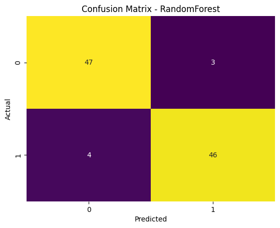

# Dopamine-Stimuli-Predictive-Model  

**Predicting dopamine-triggering patterns in children's YouTube videos using machine learning and interpretable AI**  

  
  
  
  

---

## 📜 Overview  

The **Dopamine-Stimuli-Predictive-Model** is a machine learning pipeline designed to identify **dopamine-triggering indicators** in children's YouTube videos.  
This work builds upon a **manually annotated dataset of 500 videos** (250 dopamine-inducing, 250 non-dopamine), with features spanning **video metadata, behavioral triggers, and visual/auditory patterns**.  

By leveraging **Random Forest**, **XGBoost**, and **CatBoost** classifiers alongside **SHAP interpretability**, this project aims to **quantify and interpret** the media features most associated with dopamine-inducing content in children’s media.  

This repository is a companion to the research dataset:  
**[Dopamine-YouTube-Kids-Dataset (v1.0.0) – Zenodo](https://doi.org/10.5281/zenodo.16755363)**  

---

## 🎯 Objectives  

- Detect patterns and media features that correlate with **dopamine-triggering effects**.  
- Compare multiple ML algorithms and evaluate their performance.  
- Provide **model interpretability** through SHAP plots.  
- Lay the groundwork for further academic and applied research in **children's media regulation and AI ethics**.  

---

---

## 📊 Model Performance  

**Cross-Validation Summary**  

| Model         | Avg Accuracy | Avg ROC AUC | Avg F1 | Avg Precision | Avg Recall | Avg MCC | Std ROC AUC |
|---------------|--------------|-------------|--------|--------------|------------|---------|-------------|
| **CatBoost**      | 0.9225       | **0.9724**  | 0.9219 | 0.9355       | 0.9100     | 0.8465  | 0.0139      |
| **RandomForest**  | 0.9200       | 0.9699      | 0.9182 | **0.9385**   | 0.9000     | 0.8417  | 0.0185      |
| **XGBoost**       | 0.9100       | 0.9623      | 0.9080 | 0.9267       | 0.8900     | 0.8207  | 0.0194      |

---

### **Test Set Evaluation**

#### CatBoost  
- Accuracy: **0.9200**  
- ROC AUC: **0.9664**  

| Class | Precision | Recall | F1-Score | Support |
|-------|-----------|--------|----------|---------|
| 0     | 0.90      | 0.94   | 0.92     | 50      |
| 1     | 0.94      | 0.90   | 0.92     | 50      |

**Confusion Matrix:**  
  
**SHAP Summary Plot:**  
  

---

#### Random Forest  
- Accuracy: **0.9300**  
- ROC AUC: **0.9588**  

| Class | Precision | Recall | F1-Score | Support |
|-------|-----------|--------|----------|---------|
| 0     | 0.92      | 0.94   | 0.93     | 50      |
| 1     | 0.94      | 0.92   | 0.93     | 50      |

**Confusion Matrix:**  
  
**SHAP Summary Plot:**  
  

---

#### XGBoost  
- Accuracy: **0.9100**  
- ROC AUC: **0.9518**  

| Class | Precision | Recall | F1-Score | Support |
|-------|-----------|--------|----------|---------|
| 0     | 0.89      | 0.94   | 0.91     | 50      |
| 1     | 0.94      | 0.88   | 0.91     | 50      |

**Confusion Matrix:**  
  
**SHAP Summary Plot:**  
  

---

## 🔬 Methodology  

1. **Data Preparation**  
   - Used **500 manually annotated videos**  
   - Features include:
     - Metadata (title length, duration, category, view count)
     - Dopamine indicators (bright colors, repetitive songs, rapid scene cuts, exaggerated voice)
     - Binary `dopamine_label` target variable  

2. **Modeling**  
   - Algorithms:
     - Random Forest (baseline interpretability)
     - XGBoost (gradient boosting performance)
     - CatBoost (categorical feature handling)  

3. **Evaluation Metrics**  
   - Accuracy, Precision, Recall, F1-Score, ROC AUC, MCC  
   - SHAP analysis for explainability  

4. **Interpretability**  
   - SHAP values reveal the **most influential media features** for dopamine-triggering predictions.  

---

## 🛠 Installation & Usage  

```bash
# Clone repository
git clone https://github.com/Sanjaykumar030/Dopamine-Stimuli-Predictive-Model.git
cd Dopamine-Stimuli-Predictive-Model

# Install dependencies
pip install -r requirements.txt

# Run model pipeline
python model_pipeline.py


